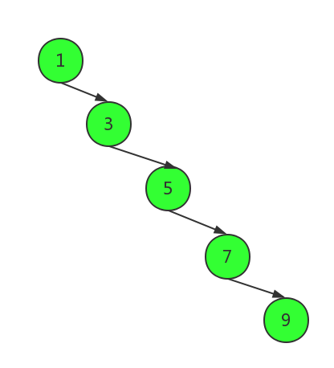
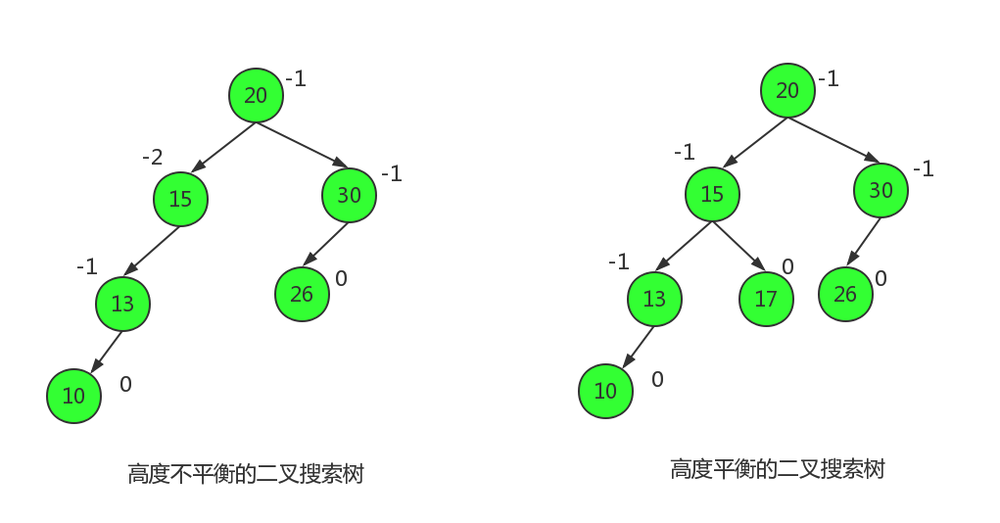

### Stack （栈）

### MinStack （最小栈）

### Queue （队列）

### LinkedList （单向链表）

### DoubleLinkList （双向链表）

### BitMap

### BoolmFilter （布隆过滤器）

### BinaryTree （二叉树）

### MinHeap （最小堆）

### MaxHeap （最大堆）

### HuffmanTree （哈夫曼树类）

### BinarySearchTree （二叉搜索树）
#### 1. 概念
二叉搜索树具有一下四点性质：
+ 所有节点关键码都互不相同
+ 左子树上所有节点的关键码都小于根节点的关键码
+ 右子树上所有节点的关键码都大于根节点的关键码
+ 左右子树也是二叉搜索树

### AVL树
#### 1.概念
讲到二叉搜索树，搜索一个数据时，进行比较次数和树的高度有关，高度越高，平均比较次数越大，
最坏的情况下，二叉搜索树等同于一个链表。 如下图所示

这样的二叉搜索树和链表没有区别，无法提高搜索效率，1962年，数学家 G. M. Adelson-Velsky和E. M. Landis 在他们的论文中发表了它，AVL就取自于这两个人的名字。

AVL树首先是一个二叉搜索树，但他具备自平衡的能力，它的左右子树都是AVL树，左右子树的高度差的绝对值不能超过1。
下图中的两棵树，一个是高度不平衡的二叉搜索树，一个是高度平衡的二叉搜索树

在每个节点旁边标注的是这个节点的平衡因子bf (balance factor)，平衡因子等于右子树的高度减去左子树的高度，对于一个有n个节点的AVL树，它的高度将保持在O()，平均搜索长度也可以保持在O()

### UFSets （并查集）
